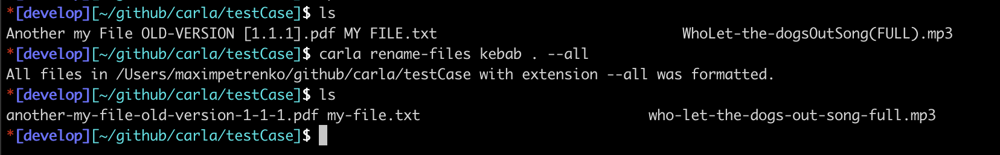

# Carla

A helper utility.

At the moment it can rename files from one style case to another and rename strings in the same way.

I got the idea for it after manually renaming a lot of files. This is very boring and tedious. However, it is convenient for me to work with files from the terminal when they are named in the same style case.

## Installation

Just clone this repo, go to it and exec `mix escript.build`

Your exec file will be in `script` folder.

Then you can add an alias in .zshrc (for example) for the path to this file and use it :)

## Examples

### Rename Files

### Rename String

